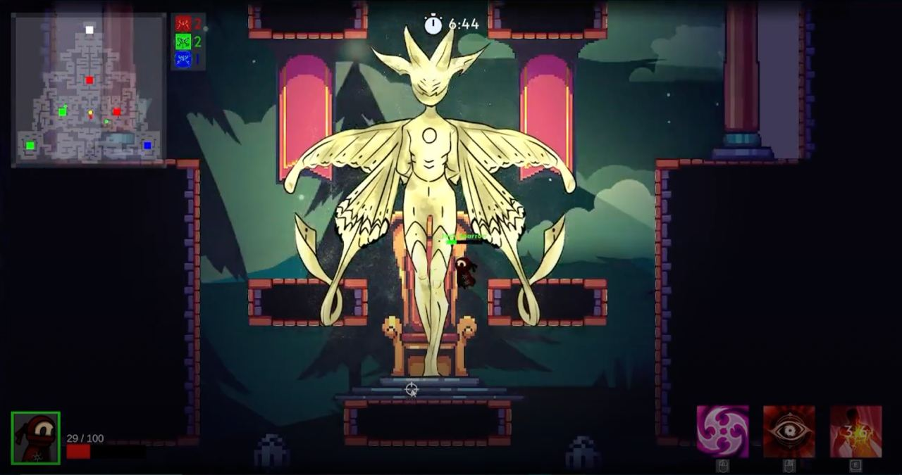

# Reya's Light

🕹️ **Progetto realizzato per l'esame di Online Game Design**  
📚 **Corso di Informatica Magistrale - Università degli Studi di Milano**  

## ⚡ Panoramica  
**Reya's Light** è un prototipo di videogioco sviluppato da un team di tre persone sotto il nome di **ConnAction Games**.  
Si tratta di un **multiplayer online competitivo**, progettato per offrire un'esperienza di gioco dinamica e strategica.  

## 🎮 Descrizione del Gioco  
**Reya's Light** si propone come un **hero shooter** con meccaniche ispirate a titoli affermati:  
- Il **game design** richiama *Brawlhalla*, con un focus su combattimenti rapidi e fluidi.  
- Il **visual design** trae ispirazione da *Hollow Knight*, con uno stile artistico evocativo e dettagliato.  

Il gameplay si sviluppa in un **multiplayer platform** in cui **tre squadre da tre giocatori** competono per conquistare **aree disposte simmetricamente** su una mappa **2D**.  

Ogni personaggio ha un **design unico** e abilità specifiche che incentivano il **gioco di squadra**.  
L'obiettivo del progetto è quello di **espandere continuamente il roster di personaggi**, introducendo periodicamente nuovi eroi per mantenere fresco e bilanciato il gameplay.  

## 🎥 Trailer  
  

🔗 **Guarda il video qui:** [Clicca per vedere](https://drive.google.com/file/d/1ZQJnZ2VmsCRnbpv0b4N226NVsDTPw0wN/view?usp=drive_link)  

